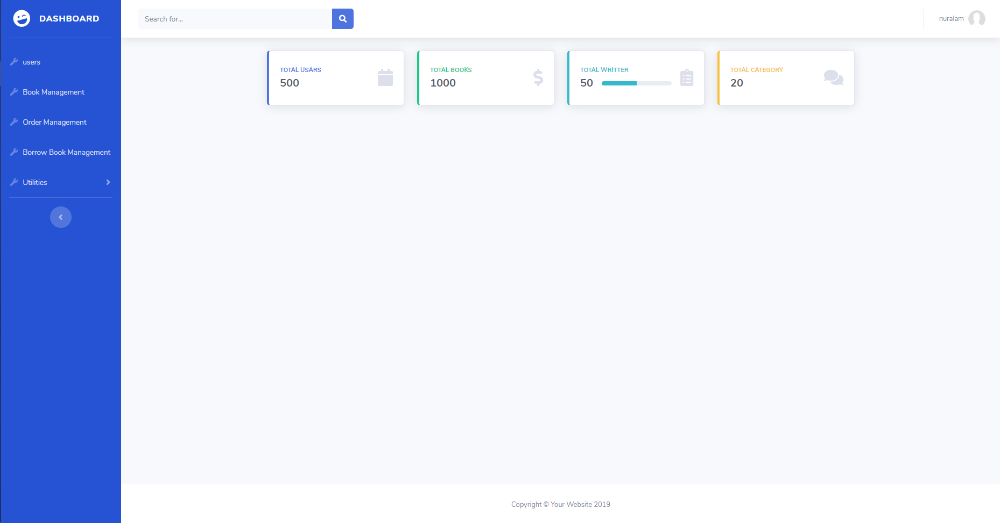
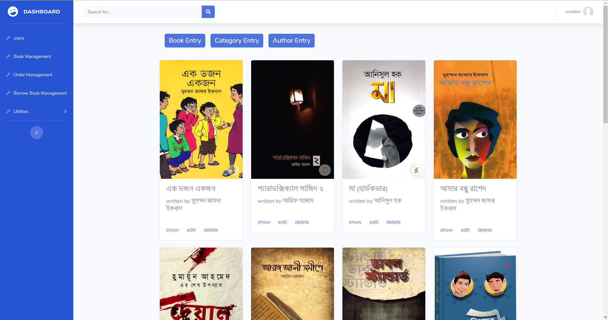
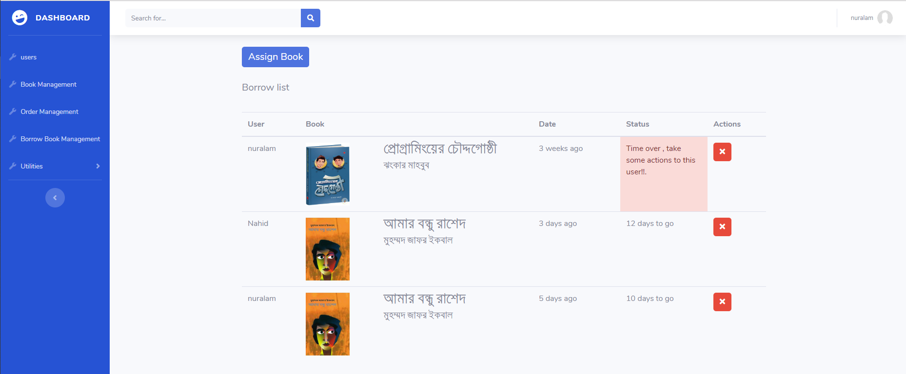
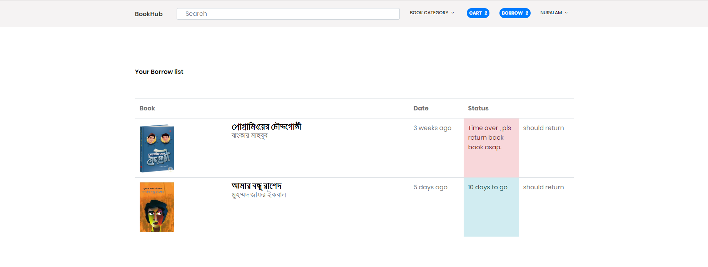
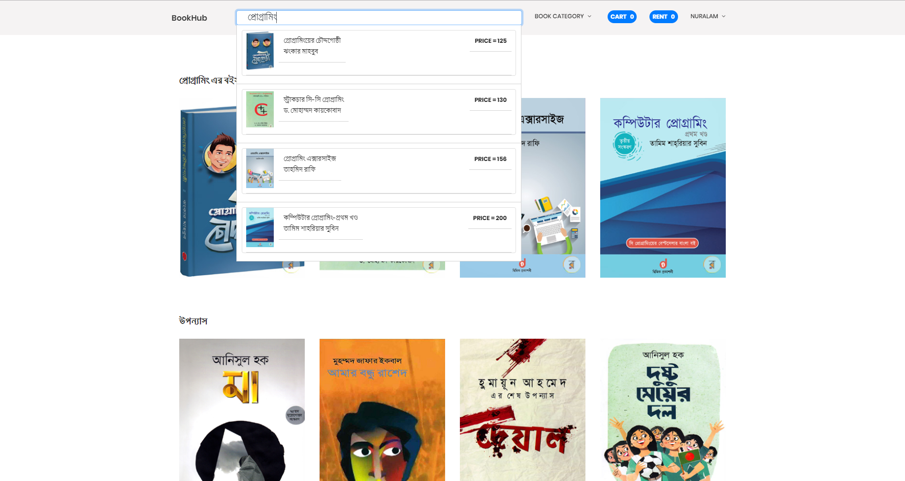
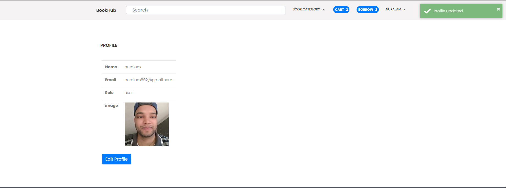

>## About BookHub

>It’s a online book store where registered user can buy books or borrow books. >User
>can add to cart, watch cart list and order books or otherwise borrow books >with cost
>of 20% of the specific book. From admin panel admin can handle users, add new
>book, new category, new author, handle orders etc.

---
>## Admin home page

>## Admin book managemant 

>## Admin borrowlist

>## frontend home page 

>## user borrowlist

>## search functionality 

>## profile page

